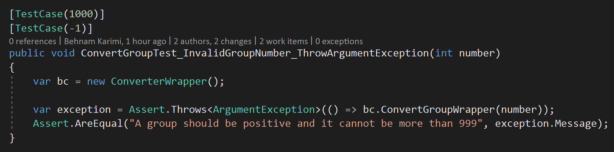
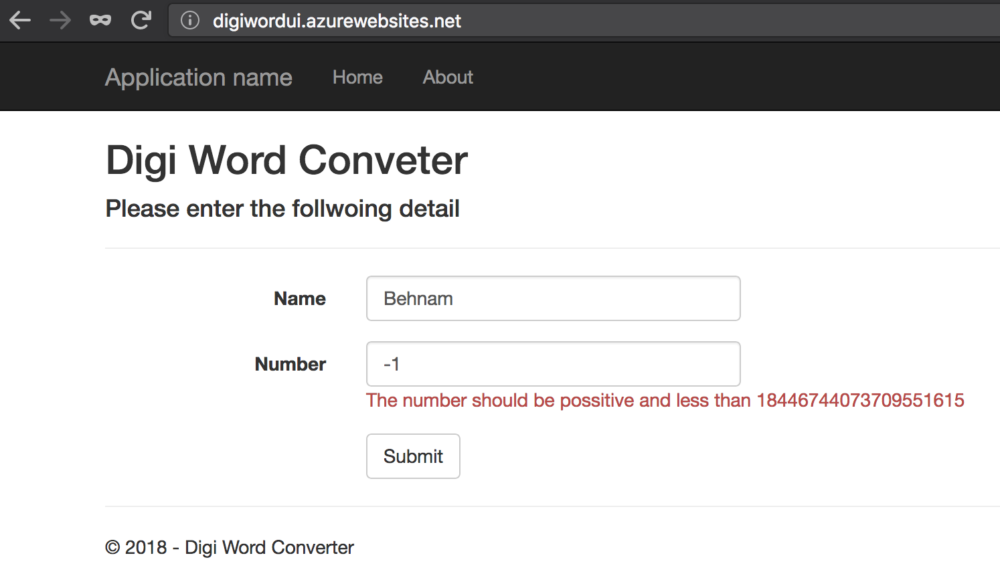

# Digi Word number to text convertor

## Content
* [Overview](#overview)
* [Project description](#project-description)
  * [Project structure](#project-structure)
  * [Business](#business)
  * [Service](#service)
  * [UI](#ui)
* [Deployment](#deployment)
* [Test](#test)
* [How to use](#how-to-use)
* [Demo](#demo)
* [Future](#future)

## Overview
Digi word is a simple number to text convertor written in C#. It gets a name and a number from the user and converts the number to its textual representation in English in terms of currency value and displays it to user.

### Author
Behnam (Naser) Karimi

Linked-in: https://www.linkedin.com/in/behnamkarimi/

Blog: http://www.dispatchertimer.com/

## Project description
The project is written with C# in .NET Framework 4.7.1. It consists of a service which exposes the convertor functionality to its users. It uses multi-layer architectural pattern to divide responsibilities.

### Project structure
Below is the solution in Visual Studio:


* Business
  * Business: provides the main functionality of the convertor.
  * Entities: contains a of DTO shared by multiple layers.
* Service: a service which exposes the convertor functionality.
* UI:
  * Process: common provider which communicates with the service. It separates the communication concerns from the UI.
  * UI: the project user interface for the end-user to communicate with the converter.
* Test: a set of unit tests to test the accuracy of the algorithm as well as the solution's building block.

### Business
`DigiWord.Business.Common.NumberConverter` is the main business component which is responsible to convert a number to its textual representation. The code self-explanatory.

An extension created on `UInt64` to enables the algorithm users to convert a number by just calling the extension method:

``` java
ulong number = 200ul;
string result = number.ToText();
```

### Service
The back-end service is developed with Web API which is a REST service to expose the converter functionality.

* It uses [AutoMapper](http://automapper.org/) to maps the service contract with DTO. The configuration is done in `DigiWord.Services.AutoMapperConfiguration`.

``` java
public static void RegisterMapping()
{
    Mapper.Initialize(config =>
        config.CreateMap<NumberDetailRequest, NumberDetail>()
    );
}
```

* [Swagger](https://github.com/domaindrivendev/Swashbuckle) is used to provides documentation and enables user to play with the converter Web API service. The configuration is done in `DigiWord.Services.SwaggerConfig`.

### UI
#### UI Process
User interface consists of two project. The `UI.Process` which is a library common to different presentation layers which facilitate the common UI logics and service communication. Although there is only one presentation created for this project the `UI.Process` is there to enables extensibility.

#### presentation
ASP.NET MVC 5 as the presentation layer. It uses the UI process to have access to the converter service.

## Deployment
Microsoft Azure is used to deploy the solution. The project consists of an **AppService** to host the Web API and a **WebAPP** to host the UI.

The **Resource Group** provisioned in _Australia Shoutheast_, consists of the AppService and the **WebApp**:


### AppService
* The AppService URL is: https://digiwordservice.azurewebsites.net/


* Swagger can be accessed via:  https://digiwordservice.azurewebsites.net/swagger


### WebApp
* The WebApp URL is: http://digiwordui.azurewebsites.net/


* A setting configured to tell the UI where the service is located:


## Test
[NUnit](http://nunit.org/) test framework is used for unit testing. There are four unit tests project each isolated the tests for a specific layer.


In order to run the unit tests locally, the service url should be configured for those testing the services:

* `DigiWord.UI.Process.Test`
* `DigiWord.UI.Web.Test`

The configuration setting can be find in their app.config:
``` xml
<appSettings>
    <!--<add key="serviceUrl" value="http://localhost:1613/" />-->
    <add key="serviceUrl" value="https://digiwordservice.azurewebsites.net/" />
</appSettings>
```
By default they set to communicate with Azure AppService unless the developer wants to use the local instance. To do so the service need to be run locally (either in IIS Express or Local IIS) prior to run these unit tests.

### Test Scenarios
Couple of test scenarios developed to evaluate the algorithm accuracy:


Exceptions have also evaluated to properly handle faults:




### Code Coverage
Except the configurations and non-unittestable blocks the unit tests covers 100% of the components (highlighted components):


## How to use
You can either clone the master or develop branch and run the project locally or use the provisioned app on Azure.

### Run locally
* Clone the repository:
`$ git clone https://github.com/disorian/digiword.git`.
* Open the solution in Visual Studio 2017: `.\digiword\code\DigiWord.sln`.
* Right click on the solution and select **Set Startup Projects**. Select **Multiple startup projects** and change the action for` DigiWord.UI.Web` and `DigiWord.Services` to **Start**.
* Press the mighty **Ctrl-F5**!

You can either use swagger to play with the service or the UI.

#### Configurations
The service url is configured in UI which points to the service runs locally on IIS Express. Modifies it as necessary (if you wanna use locally on different server the Azure):
``<add key="serviceUrl" value="http://localhost:1613/" />``

## Demo
This demo uses the app on Azure.
### UI
http://digiwordui.azurewebsites.net/


Enter your name and a number and click submit:


Don't go negative:



But you can go crazy:


### Swagger
https://digiwordservice.azurewebsites.net/swagger

expand the _Converter_ and the _endpoint_. Click on Model example let it populates the default JAON in the request body. Enter a Name and a Number and _Try it out!_


## Future
Farther features can be included in the project in later stages:
* Add data layer to log the conversion (using mongoDB).
* Use Azure Function App to deploy the converter into a server-less infrastructure.
* Enhance the UI with AnularJS to have a better UI experience

# Cheers!
